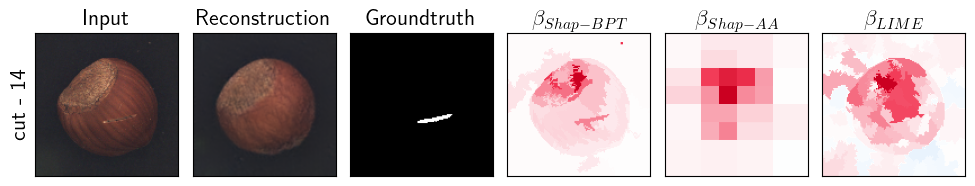

# ShapBPT in Perspective: A Consolidated Review and an eXplainable Anomaly Detection Case Study

> Venue: The Fifth Conference on System and Service Quality - [**_QualITA_**](https://qualitawg.github.io/), May 5, 2026, Florence, Italy. Qual-ITA (https://qualitawg.github.io/) is  happening with The International Conference on Performance Engineering ([**_ICPE26_**](http://icpe2026.spec.org/)) .


      <a href ="https://github.com/rashidrao-pk/XAD/blob/main/LICENSE">
        
      </a>
<a href="https://github.com/rashidrao-pk/">

</a>

      <a href="https://github.com/rashidrao-pk/">
        
      </a>


<a href="https://github.com/rashidrao-pk/XAD/graphs/contributors">

</a>
<a href="https://github.com/rashidrao-pk/XAD/issues?q=is%3Aissue+is%3Aclosed">

</a>
<a href="https://github.com/rashidrao-pk/XAD/issues">

</a>
<a href="https://github.com/rashidrao-pk/XAD/pulls?q=is%3Apr+is%3Aclosed">

</a>
<a href="https://github.com/rashidrao-pk/XAD/pulls">

</a>


<a href="https://github.com/rashidrao-pk/XAD/watchers">

</a>
<a href="https://github.com/rashidrao-pk/XAD/forks">

</a>
<a href="https://github.com/rashidrao-pk/XAD/stargazers">

</a>


---

This repository provides the experimental results and reproducibility material for eXplainable Anomaly Detection (XAD) using the **_ShapBPT_** Python package.

---

ShapBPT was recently published at the  
> 40th AAAI Conference on Artificial Intelligence ([AAAI-2026](https://aaai.org/conference/aaai/aaai-26/)), Singapore, 20–27 January 2026.

- **_ShapBPT Codes_**: https://github.com/amparore/shap_bpt  
- **_ShapBPT Python Package_**: https://pypi.org/project/shap-bpt
- **_ShapBPT ArXiv_**: https://arxiv.org/abs/2602.07047

---

## Overview

This repository contains the experiments, notebooks, and precomputed results for the paper:

ShapBPT in Perspective: A Consolidated Review and an eXplainable Anomaly Detection Case Study

The repository includes:

- Experimental results for AD Case Study(E6)
- Reproducible Jupyter notebooks
- Precomputed PDF and CSV files
- Ready-to-run ShapBPT examples
- Visualization utilities for anomaly detection

---

## 1. Environment Preparation and Installation ⚙️

To run the notebooks and reproduce the experiments, create a dedicated Python environment.

---

### 1.1 Create Conda Environment

```bash
conda create -n XAD python=3.9.18
conda activate XAD
```
---

### 1.2 Clone This Repository

```bash
git clone https://github.com/rashidrao-pk/XAD
cd XAD
pip install -r requirements.txt 
```
---

### 1.3 Install ShapBPT

Option 1 — Install from PyPI (Recommended) - See [**_PyPi Project here_**](https://pypi.org/project/shap-bpt/) 

```bash
pip install shap-bpt
```

Option 2 — Install from Source or [follow this page](https://github.com/amparore/shap_bpt?tab=readme-ov-file#installation) 

```bash
git clone https://github.com/amparore/shap_bpt
cd shap_bpt
pip install .
```

Note: ShapBPT contains a Cython module, so compilation is required when installing from source.

---

### 1.4 LaTeX Support (Optional but Recommended)

Some plots use LaTeX rendering.

Ubuntu/Linux:

```bash
sudo apt-get install texlive-latex-extra texlive-fonts-recommended dvipng cm-super
```

Windows:

Install MikTeX (or equivalent LaTeX distribution).

---

### 1.5 Verify Installation

```python
import shap_bpt
print(shap_bpt.__version__)
```

---

### 1.6 Required Dataset 🌰

Download the MVTec AD dataset: 

https://www.mvtec.com/company/research/datasets/mvtec-ad

Place it inside:

```
notebooks/datasets/
```

---

## Sample Result

<p align="center">
  
</p>

---

## 2. Precomputed Results

| Exp | Dataset | Model | PDF | CSV |
|-----|----------|--------|-------------------------------|-----------------------------------------------|
| E6 | MVTec AD | VAE-GAN | [PDF/HTML_E6_hazelnut_heatmaps_IoU.pdf](notebooks/results/HTML_E6_hazelnut_heatmaps_IoU.pdf) | csv_exp_E6_testresults_hazelnut_9_BPT_new_eval.csv |

---

## 4. Hardware Validation

The published results were generated and validated on the following systems:

| Device | Machine | Processor | RAM | GPU |
|--------|----------|------------|------|------|
| Laptop | Santech XN2 | Intel Core i9 (13th Gen) | 16GB | NVIDIA RTX 4070 |
| Laptop | MacBook Pro | Apple M1 | 16GB | Integrated M1 GPU |

---

## Acknowledgments 🙏
We gratefully acknowledge the following contributions and resources that supported this work:

### 💠 Funding
This work received funding from the European Union’s Horizon research and innovation programme Chips JU under Grant Agreement No. 101139769, as part of the DistriMuSe Project (HORIZON-KDT-JU-2023-2-RIA).
The Joint Undertaking receives support from the European Union and the participating member states.


### 🧠 Models & Pretrained Weights
We thank the developers of the model architectures and pretrained weights used in our experiments, including:


### 🗄️ Datasets
We acknowledge the dataset curators whose work made this project possible:

- [MVTec](https://www.mvtec.com/company/research/datasets/mvtec-ad)

### Keywords 🔍
Anomaly detection · Variational Autoencoder · eXplainable AI · Software quality · Smart Industries


## Citation 📃

Coming soon...

## Contributors

<a href="https://github.com/rashidrao-pk/XAD/graphs/contributors">
  
</a>
<br>

> [!NOTE]
> Contributions to improve the completeness of this list are greatly appreciated. If you come across any overlooked papers, please **feel free to [*create pull requests*](https://github.com/rashidrao-pk/XAD/pulls), [*open issues*](https://github.com/rashidrao-pk/XAD/issues) or contact me via [*email*](mailto:muhammad.rashid@unito.it)**. Your participation is crucial to making this repository even better.